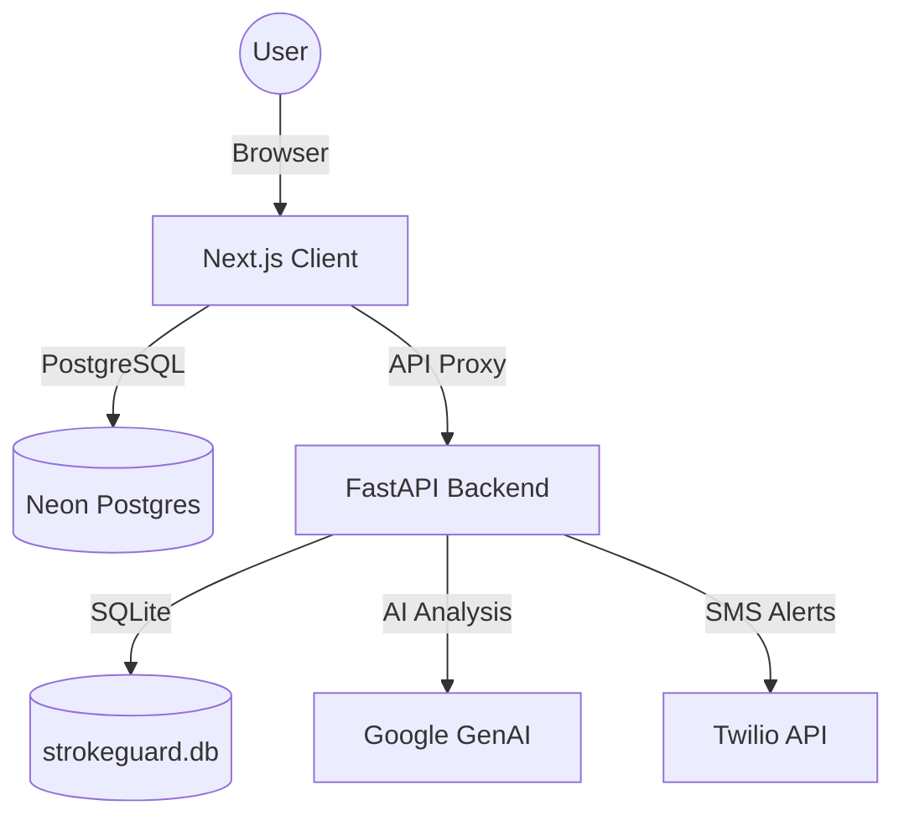

# StrokeGuard 🩺

StrokeGuard is an AI-powered stroke awareness and monitoring platform designed to help users predict, recognize, and respond to stroke risks. It leverages remote photoplethysmography (rPPG) via webcam to monitor vital signs and provides real-time AI-driven health insights.

## 🚀 Project Overview

The system consists of two main components:

- **Frontend (Client)**: A modern Next.js application that handles user authentication, dashboard monitoring, and life-saving triage UI.
- **Backend (Server)**: A Python FastAPI server that processes vital sign history, calculates advanced risk scores using Google's GenAI, and handles emergency SMS alerts via Twilio.

## 🏗️ Architecture



## ✨ Key Features

- **Real-time Monitoring**: Webcam-based heart rate and PRV (Pulse Rate Variability) detection.
- **AI Risk Assessment**: Personalized stroke risk scores based on AHA "Life's Essential 8" and real-time vitals.
- **Guided Triage (FAST Check)**: A dedicated flow for Face, Arms, Speech, and Time assessments during emergencies.
- **Emergency Protocols**: Automated dialing for emergency services (**767**) and SMS alerts to designated contacts.
- **Activity Tracking**: Intelligent "Exercise Mode" to prevent false alarms during high-intensity activity.

## 🛠️ Tech Stack

### Frontend (client/)

- **Framework**: Next.js 16 (App Router)
- **Styling**: Tailwind CSS 4
- **Auth**: Next-Auth v5 (Beta)
- **Database**: Prisma ORM (connecting to Neon PostgreSQL)
- **Charts**: Recharts
- **Icons**: Lucide React

### Backend (server/PYTHON_API)

- **Framework**: FastAPI
- **AI/ML**: Google GenAI (Gemini)
- **Communication**: Twilio SDK
- **Database**: aiosqlite (Local storage for monitoring logs)
- **Environment**: Python 3.10+

## ⚙️ Getting Started

### Prerequisites

- Node.js 18+ & pnpm
- Python 3.10+
- PostgreSQL instance (Neon recommended)
- Twilio Account & Google Gemini API Key

### Client Setup (./client)

1. Install dependencies:
   ```bash
   pnpm install
   ```
2. Set up environment variables in `.env.local`:
   ```env
   DATABASE_URL="your_postgres_url"
   AUTH_SECRET="your_next_auth_secret"
   EXTERNAL_API_URL="http://localhost:8000"
   ```
3. Initialize the database:
   ```bash
   npx prisma generate
   npx prisma db push
   ```
4. Run the development server:
   ```bash
   pnpm dev
   ```

### Server Setup (./server/PYTHON_API)

1. Set up a virtual environment:
   ```bash
   python -m venv .venv
   source .venv/bin/activate
   ```
2. Install dependencies:
   ```bash
   pip install -r requirements.txt
   ```
3. Set up environment variables in `.env`:
   ```env
   GOOGLE_API_KEY="your_gemini_key"
   TWILIO_ACCOUNT_SID="your_sid"
   TWILIO_AUTH_TOKEN="your_token"
   TWILIO_PHONE_NUMBER="your_twilio_number"
   ```
4. Start the server:
   ```bash
   uvicorn main:app --reload
   ```

## 📜 License

This project is licensed under the MIT License.
